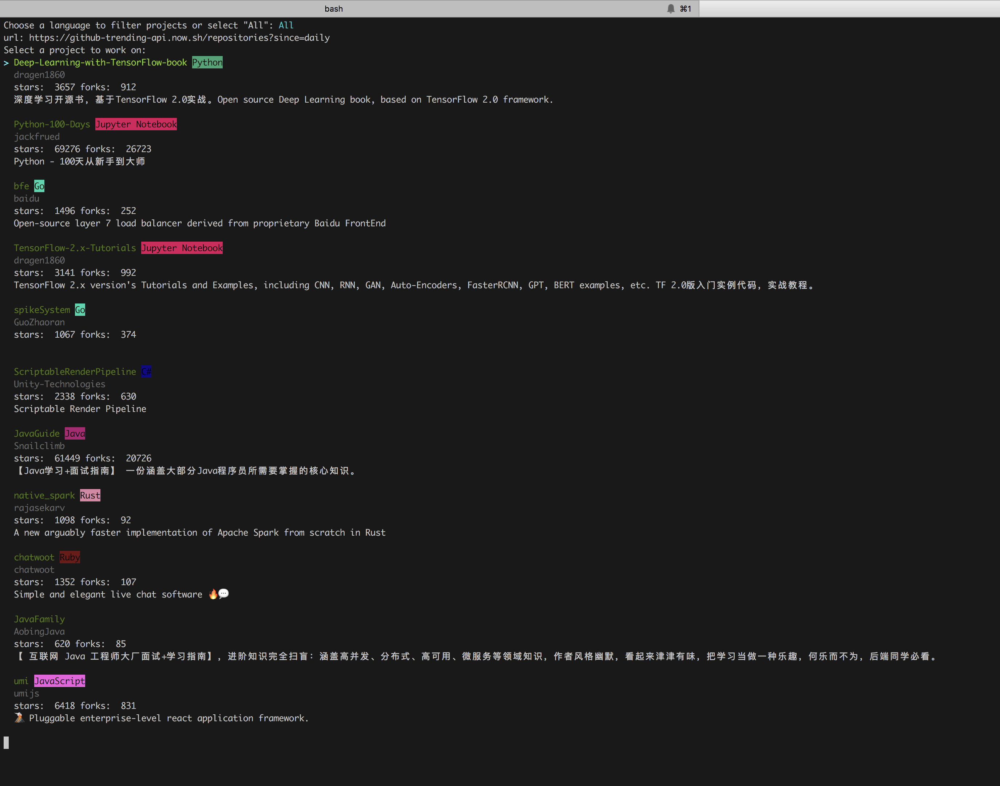

# trending
This is an Op for the CTO.ai [Ops Platform](https://cto.ai/platform) that returns all trending projects on Github based on the timespan and language selected. 

Under the hood this Op uses [huchenme/github-trending-api](https://github.com/huchenme/github-trending-api) to find projects.

  

## Next Steps
- Update the code to accept command line args and bypass prompts

